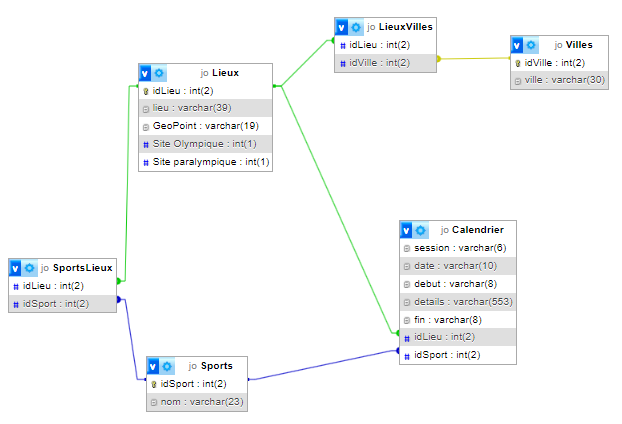

# TP JO 2024

## Data

Localhost:
http://localhost

PHPMyAdmin:
http://localhost:8081

## Etapes de travail

On demande aux étudiants de créer une liste de tâches à réaliser pour le projet.
Ils doivent réussir à décomposer les différentes étapes, les catégoriser et les ordonner.

### Exemple de liste de tâches

1. Créer son environnement de travail

- Base de données créée
- Dossier de travail
- Script de connexion à la base de données

- Import des données dans la base

2. Accès aux données

- Créer un script permettant d'afficher les données de la base
  - Sports
  - Villes
  - Lieux

- Utilisation d'un framework CSS pour la mise en forme

- Menu de navigation entre les pages